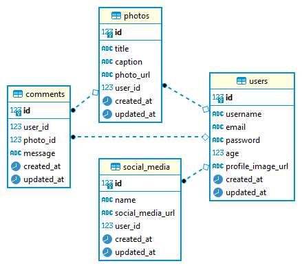

# MyGram Project

## Description

Program ini merupakan final project untuk Kelas Scalable Web Service with Golang - DTS Kominfo

## How To Build Program and Run It

- Buka terminal pada direktori ./mygram
- Masukkan perintah di bawah ini

```
<!-- For Windows -->
go build -o mygram.exe
```

```
<!-- For Non Windows -->
go build -o mygram
```

- Jalankan file baru yang telah dibuild pada folder.

## How to fast run

- Buka terminal pada direktori ./mygram
- Masukkan perintah di bawah ini

```
go run main.go
```

## How To Test

### Via Postman

- Buka [link ini](./MyGram%20API.postman_collection.json) dan simpan sebagai json
- Import file json pada Postman
- Lakukan tes pada setiap Endpoint

### Via Swagger UI

- Buka [link ini](http://localhost:8080/swagger/index.html)
- Lakukan tes pada setiap Endpoint

### Link To Test

#### Users

| Name Endpoint | Endpoint                             | Method | Details                              |
| ------------- | ------------------------------------ | ------ | ------------------------------------ |
| Register User | http://localhost:8080/users/register | POST   | [Open](./API-SPEC.md#register-users) |
| Login User    | http://localhost:8080/users/login    | POST   | [Open](./API-SPEC.md#login-users)    |
| Update User   | http://localhost:8080/users/{id}     | PUT    | [Open](./API-SPEC.md#update-users)   |
| Delete User   | http://localhost:8080/users/{id}     | DELETE | [Open](./API-SPEC.md#delete-users)   |

#### Photos

| Name Endpoint | Endpoint                          | Method | Details                             |
| ------------- | --------------------------------- | ------ | ----------------------------------- |
| Create photo  | http://localhost:8080/photos      | POST   | [Open](./API-SPEC.md#create-photos) |
| Get photos    | http://localhost:8080/photos      | GET    | [Open](./API-SPEC.md#get-photos)    |
| Update photo  | http://localhost:8080/photos/{id} | PUT    | [Open](./API-SPEC.md#update-photos) |
| Delete photo  | http://localhost:8080/photos/{id} | DELETE | [Open](./API-SPEC.md#delete-photos) |

#### Comments

| Name Endpoint  | Endpoint                            | Method | Details                               |
| -------------- | ----------------------------------- | ------ | ------------------------------------- |
| Create comment | http://localhost:8080/comments      | POST   | [Open](./API-SPEC.md#create-comments) |
| Get comments   | http://localhost:8080/comments      | GET    | [Open](./API-SPEC.md#get-comments)    |
| Update comment | http://localhost:8080/comments/{id} | PUT    | [Open](./API-SPEC.md#update-comments) |
| Delete comment | http://localhost:8080/comments/{id} | DELETE | [Open](./API-SPEC.md#delete-comments) |

#### Social Media

| Name Endpoint       | Endpoint                                | Method | Details                                    |
| ------------------- | --------------------------------------- | ------ | ------------------------------------------ |
| Create social media | http://localhost:8080/socialmedias      | POST   | [Open](./API-SPEC.md#create-social-medias) |
| Get social medias   | http://localhost:8080/socialmedias      | GET    | [Open](./API-SPEC.md#get-social-medias)    |
| Update social media | http://localhost:8080/socialmedias/{id} | PUT    | [Open](./API-SPEC.md#update-social-medias) |
| Delete social media | http://localhost:8080/socialmedias/{id} | DELETE | [Open](./API-SPEC.md#delete-social-medias) |

# Entity Relational Diagram



# About Me

- Nama: Haiqal Ramanizar Al Fajri
- Kode Peserta: 149368582101-637
- Alamat: Bogor
- Alasan memilih kelas Golang: Ingin mengenal lebih dalam dan menambah ilmu terkait Golang dan backend.
